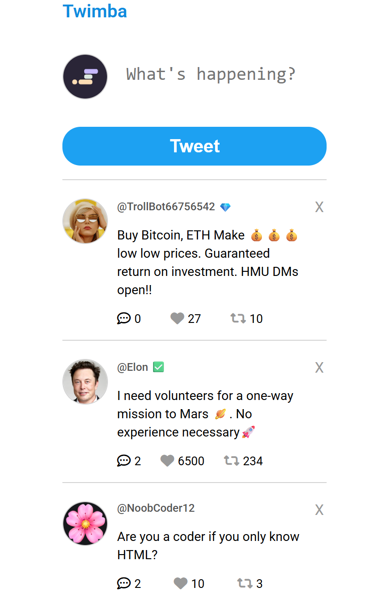

# Twimba – Twitter Clone Frontend

A simple Twitter/X inspired frontend project built with **HTML, CSS, and JavaScript**.  
Users can create tweets, like posts, retweet, reply to tweets, delete tweets, and keep data saved using **Local Storage**.

## Live Demo

👉 https://fanciful-ganache-dc09a2.netlify.app/

---

## Features

- Create new tweets
- Like / Unlike tweets
- Retweet / Undo retweet
- Reply to specific tweets
- Reply section toggle
- Delete tweets
- Data persistence using Local Storage
- Dynamic rendering with JavaScript
- Responsive clean UI

---

## Tech Stack

- HTML5
- CSS3
- JavaScript (ES6 Modules)
- Local Storage API

---

## Project Structure

```text
Twimba/
│── index.html
│── index.css
│── index.js
│── data.js
│── README.md
└── images/
```

---

## Screenshots

<p align="center">
  
  <br>
  <em>Twimba Homepage</em>
</p>

---

## What I Learned

- DOM manipulation
- Event delegation
- Dynamic rendering
- Working with nested arrays/objects
- and a lot more

---

## Challenges Faced

- Replying to the correct tweet
- Keeping reply section open after re-render
- Fixing deployment image paths

---

## Future Improvements

- Edit tweets
- Dark mode
- Better mobile responsiveness
- Backend integration

---

## Author

Shivam Kaushik  
GitHub: https://github.com/yourusername
